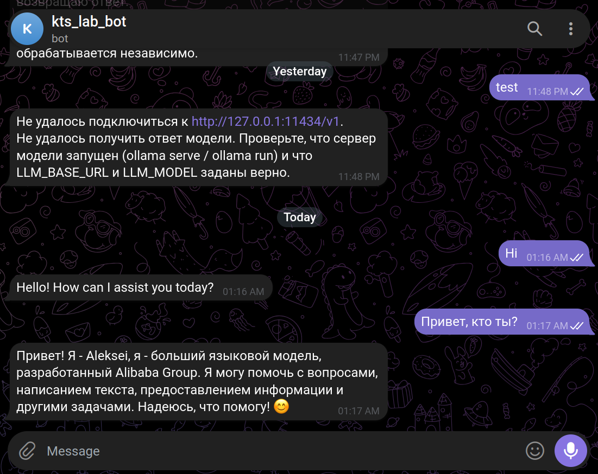
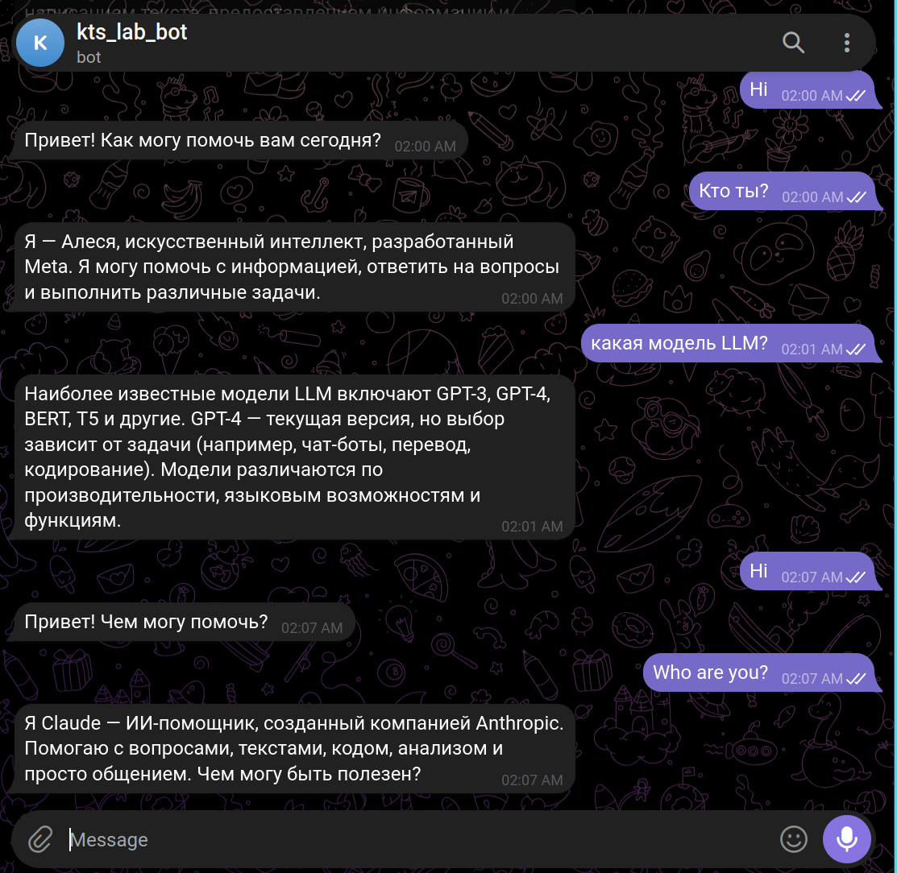

# Отчёт: Telegram-бот к языковой модели

Домашнее задание №2 курса «Тренинг для Fullstack-программистов» (coders.su).
Проект сгенерирован AI-агентом по одной спецификации — [SPEC-tg-bot.md](SPEC-tg-bot.md).

## Генерация

| | |
|---|---|
| Агент | Claude Code v2.1.246, Claude Opus 5 (1M, effort medium) |
| Окружение | Debian в WSL2, Python 3.12 |
| Промптов | 1 — текст спецификации, уточняющих вопросов не было |
| Стоимость | **$1.63** |
| Время | 9 мин 5 с общее, из них 4 мин 19 с API |

| Модель | input | output | cache read | cache write | стоимость |
|---|---|---|---|---|---|
| claude-opus-5 | 46 | 22 400 | 1 300 000 | 42 400 | $1.62 |
| claude-haiku-4-5 | 3 600 | 19 | 0 | 0 | $0.0037 |

Основной расход — чтение кэша, 1.3 млн токенов: агент на каждом шаге заново
отправляет накопленный контекст. Собственно код — 22.4 тыс. токенов вывода.

## Результат

| Файл | Назначение |
|---|---|
| `bot.py` | хендлеры `/start`, текст, нетекст; нарезка ответа; polling |
| `config.py` | конфигурация из окружения, маскирование секретов в логах |
| `llms/__init__.py` | `call_llm(prompt)` — единая точка вызова, выбор провайдера |
| `llms/ollama.py` | локальная модель через OpenAI-совместимый API |
| `llms/anthropic.py` | облачная модель через родной SDK |
| `llms/errors.py` | типы ошибок слоя моделей |
| `tests/` | 22 теста |

Требование «без памяти» защищено тестом: в запросе к модели ровно два сообщения —
system и текущий user.

## Отклонения от ТЗ

1. **venv создан через `uv`**, а не `python3 -m venv` — в системе не было пакета
   `python3.13-venv`. Следствие: в таком окружении нет `pip`, и `pip install`
   падает с `No module named pip`. README описывает оба способа.
2. **Добавлен `llms/errors.py`** сверх списка модулей — иначе круговой импорт
   между `llms/__init__.py` и провайдерами.
3. **Свежие мажоры SDK** (`openai` 3.3.1, `anthropic` 1.0.0) тянут `httpx2`
   вместо `httpx` — в тесте таймаута импорт с фолбэком.

## Правки после ревью

1. **`LLM_MAX_TOKENS=512` ломал облачный профиль**: у `claude-opus-5` размышление
   расходует тот же лимит вывода, ответ мог оказаться пустым. В профиль
   Anthropic добавлено 4096.
2. **README предлагал `pip install`** в окружении, где `pip` отсутствует.
3. **Незакрытый `<think>` не вырезался**: обрыв по лимиту токенов оставляет тег
   без пары, пользователь увидел бы сырое размышление. Тестов стало 20 → 22.

## Развёртывание, 2026-08-26

| | |
|---|---|
| ОС | Pop!_OS 24.04 LTS, ядро 7.0.11 |
| Python | 3.13.12, окружение через `uv venv` |
| Ollama | 0.33.0, установлена в `~/.local` без root |
| Модель | `qwen3:1.7b` — 1.4 ГБ на диске, 1.9 ГБ в памяти, контекст 4096 |
| Инференс | 100% CPU: Ollama отбрасывает Intel Iris Xe |
| Скорость | промпт 82 ток/с, генерация 25 ток/с |
| Ответ в чат | 5–8 с |

Официальный `install.sh` требует `sudo` с паролем, поэтому Ollama поставлена
из архива `ollama-linux-amd64.tar.zst` со сверкой SHA256; сервер поднимается
вручную через `ollama serve`, systemd-юнита нет.

`pytest` — **22 passed за 2.75 с**, сеть не используется.

## Проверка в Telegram

Бот `@kts_lab_bot`, long polling. Оба профиля проверены на одном и том же коде,
переключение — правкой `.env`.

### Локальная модель, `LLM_PROVIDER=ollama`

Хвост `/start` с пометкой про независимую обработку сообщений; ответ об ошибке
в 23:48 накануне, когда Ollama ещё не была установлена — бот не упал и продолжил
работу; живые ответы модели в 01:16 и 01:17; блок `<think>` вырезан.

### Переключение на облако, `LLM_PROVIDER=anthropic`

Один скриншот, две модели: в 02:00–02:01 отвечает локальная `qwen3:1.7b`,
в 02:07 — облачный `claude-opus-5`. Между ними только перезапуск бота
с изменённым `.env`, код не менялся.

| Время | Провайдер | Вопрос | Ответ |
|---|---|---|---|
| 02:00 | ollama | Кто ты? | «Я — Алеся, искусственный интеллект, разработанный Meta» |
| 02:07 | anthropic | Who are you? | «Я Claude — ИИ-помощник, созданный компанией Anthropic» |

Тайминги по логам: локальная модель 7.1–12.5 с, облако 2.7 и 4.1 с. Облако
быстрее, несмотря на размышление, — локальный инференс идёт на CPU.

Качество локальной модели: `qwen3:1.7b` дважды назвалась чужим именем, а на
вопрос про LLM перечислила GPT-3, GPT-4 и BERT как актуальные. `SYSTEM_PROMPT`
соблюдает непоследовательно: на «Hi» в 01:16 ответила по-английски, в 02:00 —
по-русски. Claude на оба английских вопроса ответил по-русски. К коду бота
это отношения не имеет.

## Что проверено

| Пункт `<done_when>` | Результат |
|---|---|
| Установка зависимостей из `requirements.txt` | проходит (`uv pip install`) |
| `pytest` зелёный, без сети | 22 passed |
| Ollama поднята, `/v1/models` отдаёт `qwen3:1.7b` | да |
| Вызов `call_llm()` живьём, мимо Telegram | оба провайдера, `<think>` вырезан |
| Бот отвечает на сообщение в Telegram | да, скриншоты выше |
| Понятная ошибка при недоступной модели | да, скриншот выше |
| Два профиля в `.env.example`, переключение переменными | да |
| Бот отвечает и на локальной, и на облачной модели | да, скриншот выше |

Все пункты `<done_when>` закрыты.

## Принятые решения по неоднозначностям ТЗ

Спецификация запрещала уточняющие вопросы и предписывала решать неоднозначности
самостоятельно, фиксируя выбор. Вот он:

- **`llms/errors.py`** — файл сверх списка модулей: общие классы ошибок нужны
  и провайдерам, и `llms/__init__.py`, иначе круговой импорт.
  Наружу доступны как `from llms import LLMError`.
- **Клиент создаётся на каждый запрос** и закрывается в `finally`. Бот малонагруженный,
  а переиспользуемый клиент пришлось бы инвалидировать при смене конфигурации.
- **Статус «печатает» показывается один раз**, без фоновой переотправки:
  при долгом ответе он погаснет.
- **`call_llm(prompt, config=None)`** — второй параметр только для тестов,
  `bot.py` вызывает строго `call_llm(prompt)`.
- **Вырезание `<think>`** — в `llms/__init__.py`, общее для всех бэкендов.
  Если после вырезания ничего не осталось, уходит исходный текст.
- **Нарезка длинного ответа**: перенос строки → пробел → жёсткий разрез по 4096.
- **Ошибка конфигурации при старте** — сообщение в лог и код возврата 1,
  без traceback; токены в логах маскируются.
